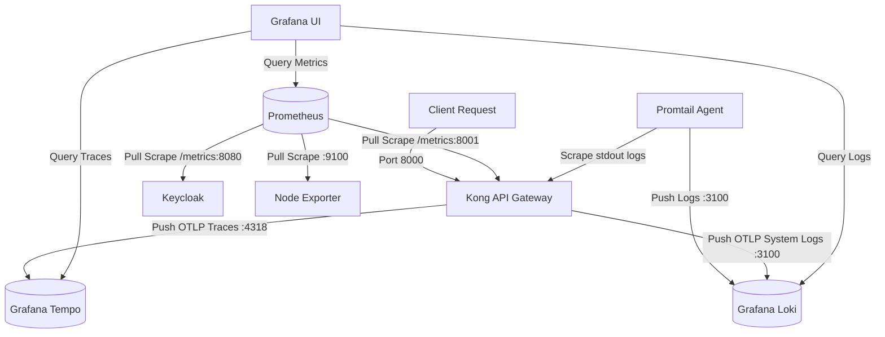

# Observability Stack: Metrics, Logs & Distributed Tracing

This document describes the containerized observability stack configured for Kong, Keycloak, Prometheus, Grafana, Loki, Promtail, and Tempo.

---

## 1. Architecture Overview

The system collects three main telemetry types: **Metrics** (aggregates), **Logs** (events), and **Traces** (request lifecycles).



---

## 2. Metrics (Prometheus & Node Exporter)

Metrics provide aggregate numerical data to identify global system performance, error rates, and resource utilization.

*   **Kong Metrics**: Exposes metrics on `http://localhost:8001/metrics` using the bundled `prometheus` plugin.
*   **Keycloak Metrics**: Emits JVM and authentication metrics on `http://localhost:8080/metrics`.
*   **Host Metrics**: Collected by `node-exporter` (CPU, memory, disk, network) for host environment monitoring.
*   **Collector**: Prometheus scrapes all targets every `15s` (configured in [prometheus/prometheus.yml](./prometheus/prometheus.yml)).

---

## 3. Logs (Loki & Promtail)

Logs capture detailed events from requests, errors, and system status.

*   **Access Logs Scraper (Promtail)**: Runs as an agent container that automatically discovers the `kong` container. It reads the container's standard output (Nginx proxy access logs), extracts metadata labels (`route`, `method`, `status`, `container`, `service_name`), and forwards them to Loki.
*   **OTLP Direct Log Ingestion**: Loki accepts direct OTLP log transmissions on `http://loki:3100/otlp/v1/logs`. The Kong OpenTelemetry plugin uses this endpoint to ship gateway system and process events.
*   **Spam Filtering**: Promtail is configured to automatically drop noisy Prometheus metric scrapes (`/metrics`), status check requests (`/status`), and Keycloak health pings (`/health`) so they do not clutter the logs database.
*   **Log-to-Trace Linkage**: Logs are automatically correlated with distributed traces. When viewing logs in Grafana, any line containing a `traceID` receives a clickable link that opens the corresponding trace in Tempo.

---

## 4. Traces (OpenTelemetry & Grafana Tempo)

Traces track the execution path of individual requests across system components to pinpoint bottlenecks and latency issues.

*   **Kong Instrumentation**: Kong is configured to inspect request contexts with tracing enabled globally:
    *   `KONG_TRACING_INSTRUMENTATIONS: all` (Traces the router, balancer, and internal execution).
    *   `KONG_TRACING_SAMPLING_RATE: "1.0"` (Samples 100% of requests for development; tune down for production).
*   **Exporter**: The Kong `opentelemetry` plugin pushes traces directly to the OTLP/HTTP collector port on Tempo.
*   **Collector & Backend**: Grafana Tempo (`grafana/tempo`) runs as a lightweight trace ingestion and storage backend:
    *   `http://tempo:4318/v1/traces` (Receives HTTP OTLP spans from Kong).
    *   `http://tempo:4317` (Available for gRPC OTLP exporters).

---

## 5. Visualization (Grafana Integration)

Grafana consolidates metrics, logs, and tracing databases into a single interface.

*   **Dashboards**: Grafana is provisioned to load dashboards for Kong Gateway, Keycloak, and VMs automatically.
*   **Tempo Tracing Analytics**: A custom dashboard (`tempo-tracing-analytics`) is provisioned showing a traces table and related Loki access logs in a unified view. You can select a specific API route to filter both panels simultaneously.
*   **Datasources**:
    *   **Prometheus**: The default datasource querying `http://prometheus:9090`.
    *   **Loki**: The logging datasource querying `http://loki:3100` (provisioned via [loki.yml](./grafana/provisioning/datasources/loki.yml)).
    *   **Tempo**: The tracing datasource pointing to `http://tempo:3200` (provisioned via [tempo.yml](./grafana/provisioning/datasources/tempo.yml)).

---

## 6. Verification & Usage Guide

Once the stack is deployed (`./deploy.sh`), you can verify the telemetry pipelines as follows:

### Generating Activity
Send test requests through the Kong proxy to populate dashboards, logs, and traces:
```bash
curl -i http://localhost:8000/service1
curl -i http://localhost:8000/service2
```

### Checking Metrics
1. Open **Grafana** at [http://localhost:3000](http://localhost:3000).
2. Go to **Dashboards** and select **Kong API Gateway** to check traffic volume, bandwidth, and latency statistics.

### Inspecting Traces & Logs
1. Inside Grafana, go to **Dashboards** -> **Tempo Tracing Analytics**.
2. Select a specific route (e.g. `/service1`) or leave as `All` to inspect.
3. The **Traces** table will show all sampled gateway spans. Clicking a Trace ID opens its timeline representation.
4. The **Kong Access Logs** panel at the bottom lists request events. Expand any log line to see extracted labels and click the **View Trace in Tempo** button to correlate logs to traces.
