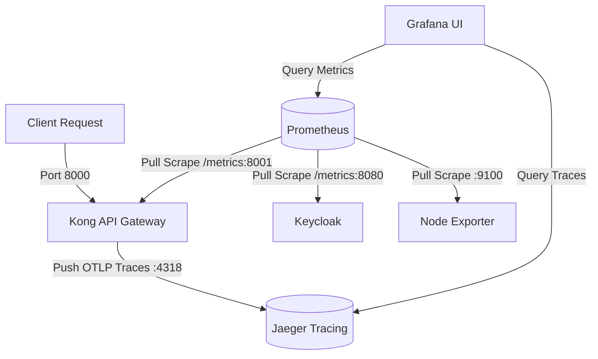

# Observability Stack: Metrics & Distributed Tracing

This document describes the containerized observability stack configured for Kong, Keycloak, Prometheus, Grafana, and Jaeger. 

---

## 1. Architecture Overview

The system collects two main telemetry types: **Metrics** (aggregates) and **Traces** (request lifecycles).



---

## 2. Metrics (Prometheus & Node Exporter)

Metrics provide aggregate numerical data to identify global system performance, error rates, and resource utilization.

*   **Kong Metrics**: Exposes metrics on `http://localhost:8001/metrics` using the bundled `prometheus` plugin.
*   **Keycloak Metrics**: Emits JVM and authentication metrics on `http://localhost:8080/metrics`.
*   **Host Metrics**: Collected by `node-exporter` (CPU, memory, disk, network) for host environment monitoring.
*   **Collector**: Prometheus scrapes all targets every `15s` (configured in [prometheus/prometheus.yml](./prometheus/prometheus.yml)).

---

## 3. Traces (OpenTelemetry & Jaeger)

Traces track the execution path of individual requests across system components to pinpoint bottlenecks and latency issues.

*   **Kong Instrumentation**: Kong is configured to inspect request contexts with tracing enabled globally:
    *   `KONG_TRACING_INSTRUMENTATIONS: all` (Traces the router, balancer, and internal execution).
    *   `KONG_TRACING_SAMPLING_RATE: "1.0"` (Samples 100% of requests for development; tune down for production).
*   **Exporter**: The Kong `opentelemetry` plugin pushes traces directly to the OTLP/HTTP collector port on Jaeger.
*   **Collector & Backend**: Jaeger (`jaegertracing/all-in-one`) runs as a self-contained collector, database, and UI service:
    *   `http://jaeger:4318/v1/traces` (Receives HTTP OTLP spans from Kong).
    *   `http://jaeger:4317` (Available for gRPC OTLP exporters).

---

## 4. Visualization (Grafana Integration)

Grafana consolidates metrics and tracing databases into a single interface.

*   **Dashboards**: Grafana is provisioned to load dashboards for Kong Gateway, Keycloak, and VMs automatically.
*   **Datasources**:
    *   **Prometheus**: The default datasource querying `http://prometheus:9090`.
    *   **Jaeger**: Added as a tracing datasource pointing to `http://jaeger:16686` (provisioned via [jaeger.yml](./grafana/provisioning/datasources/jaeger.yml)).

---

## 5. Verification & Usage Guide

Once the stack is deployed (`./deploy.sh`), you can verify both observability telemetry pipelines as follows:

### Generating Activity
Send test requests through the Kong proxy to populate dashboards and traces:
```bash
curl -i http://localhost:8000/
```

### Checking Metrics
1. Open **Grafana** at [http://localhost:3000](http://localhost:3000).
2. Go to **Dashboards** and select **Kong API Gateway** to check traffic volume, bandwidth, and latency statistics.

### Inspecting Traces
1. Access the **Jaeger UI** directly at [http://localhost:16686](http://localhost:16686).
2. Select `kong-gateway` from the **Service** dropdown and click **Find Traces**.
3. Alternatively, inside Grafana:
   - Navigate to the **Explore** tab.
   - Choose the **Jaeger** datasource from the top dropdown.
   - Run trace search queries directly in the Grafana UI.
